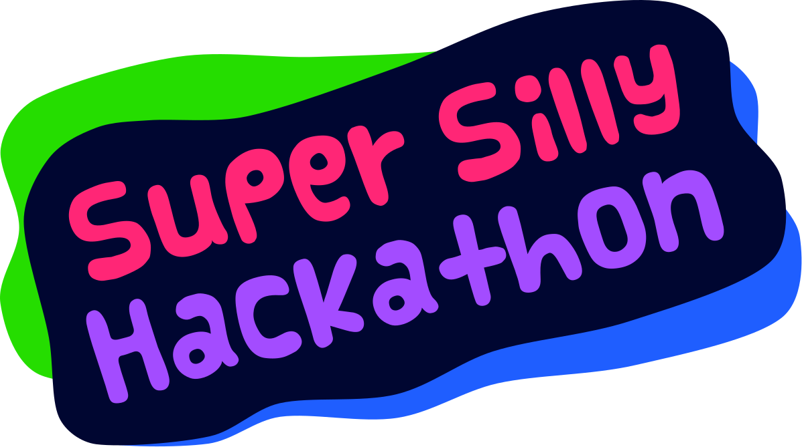

Super Silly Hackathon BRANDING
===

> Branding for Super Silly Hackathon

Two directories:

- `sources`: source artwork files, made with [Affinity Designer](https://affinity.serif.com/en-us/designer/).
- `exports`: files exported into `SVG` and `PNG` formats.

Font used is [Vanilla](https://www.fontsquirrel.com/fonts/vanilla) designed by Cutie Explosion.

Designed by [Chee Aun](https://twitter.com/cheeaun).